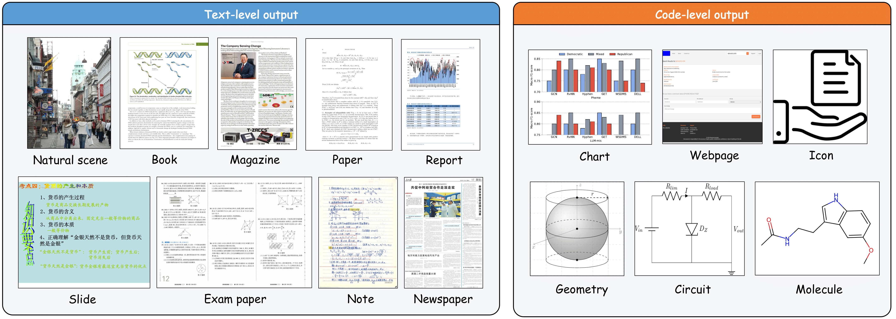
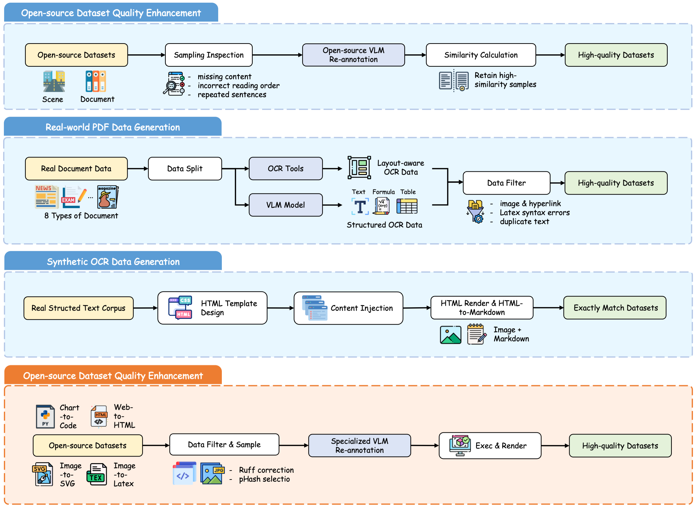

<div align="center">
  <h1>OCRVerse: Towards Holistic OCR in End-to-End  Vision-Language Models</h1>
</div>

<div align="center">
<!-- <a href=''></a>&ensp;
<a href=''></a>&ensp; -->
<a href=https://github.com/tatsu-lab/stanford_alpaca/blob/main/LICENSE></a>

<!-- Lei Chen, Xuanle Zhao, Zhixiong Zeng†, Jing Huang, Yufeng Zhong, Lin Ma* -->
</div>

<!-- <div align="center">
<strong>Meituan Group</strong>
</div>
<div align="center">
† Project Leader; * Corresponding Author
</div> -->

---

We introduce OCRVerse, which advances traditional document OCR to the next-generation holistic OCR via comprehensive data and methodological practices.
OCRVerse not only recognizes traditional optical character, but also **parses complex visual symbols through code-level representations**, enabling broad applications across domains including statistics, office, math, chemical, physical etc.
To this end, we constructed **a large-scale interdisciplinary dataset** spanning heterogeneous data sources, with innovative practices in **data rendering and model synthesis**. 
Based on this, we develop an **end-to-end lightweight vision-language model** (built on Qwen3-VL 4B) with two specialized variants: **OCRVerse-text** dedicated to character-level output and **OCRVerse-code** specialized in code-level output.
We conduct extensive experiments to validate the effectiveness of our approach and reveal the potential of holistic OCR.
Experimental results show that our method achieves an overall score of 87.9 on OmniDocbench, which is competitive with the state-of-the-art end-to-end VLM model. 
Besides, our method demonstrates comprehensive advancement on a wider range of charts, web pages, SVGs, molecular formulas, and circuit diagrams, taking a key step towards holistic OCR applications.
<div align="center">
<!--  -->
</div>

# 📢 News and Updates
* ```2025.11.3``` We upload our model weights [OCRVerse-code](https://huggingface.co/DocTron/OCRVerse-code) to HuggingFace.
* ```2025.10.27``` We upload our model weights [OCRVerse-text](https://huggingface.co/DocTron/OCRVerse-text) to HuggingFace.
<!-- * ```2025.07.21``` 🔥🔥🔥 We release the technical report of **Chart-R1** at arXiv [link](https://arxiv.org/abs/2507.15509). -->


# 🤗 Models
|  Model   | Download Link  |
|  ----  | ----  |
|  OCRVerse-text |  [DocTron/OCRVerse-text](https://huggingface.co/DocTron/OCRVerse-text)  |
|  OCRVerse-code |  [DocTron/OCRVerse-code](https://huggingface.co/DocTron/OCRVerse-code)  |

<!-- The ```Chart-COT``` is Qwen2.5-VL-7B-Instruct fine-tuned with supervised learning on the ChartRQA-SFT dataset. The ```Chart-R1``` is Chart-COT further optimized through reinforcement fine-tuning (RFT). -->

# 📚 Dataset Sources

OCRVerse encompasses both **text-level** and **code-level** data sources, comprehensively supporting the data requirements of holistic OCR. 
- The **text-level** data sources span nine scenario types: natural scenes, books, magazines, papers, reports, slides, exam papers, notes, and newspapers. These categories cover high-frequency daily text carriers, fulfill fundamental OCR needs, and avoid both scenario redundancy and gaps. 
- The **code-level** data sources comprise six scenario types: charts, webpages, icons, geometry, circuits, and molecules. These focus on professional structured scenarios and address gaps not covered by text-level categories.



# 📥 Data Processing

Our training dataset is constructed through a systematic multi-stage pipeline that integrates both **text-level** and **code-level** data sources to ensure comprehensive coverage and high quality.

**Text-level data construction.** To build a multi-scenario, multi-type document OCR dataset, we combine open-source and self-built data to balance scale and quality. 
- Open-source data provides low-cost, large-scale coverage but suffers from uneven quality due to scattered sources and lack of unified annotation standards; we employ VLM for quality optimization to improve usability. 
- To address gaps in real-world scenarios, self-built data serves as a key supplement: 
  - we collect real PDF documents matching practical layouts, fonts, colors, and resolutions with VLM-powered precise annotation.
  - we crawl public high-quality online documents, converting them to images via browser rendering to enrich data types and expand scenario coverage.

**Code-level data construction.** We begin by curating a diverse corpus from open-source datasets through rigorous filtering and diversity-aware sampling. Subsequently, we employ specialized VLMs for high-quality re-annotation to ensure label accuracy and consistency. Finally, we enhance the data through execution validation and rendering processes to generate executable code-image pairs.



# 📊 Performance

## OCRVerse-text

OCRVerse-text is evaluated on OmniDocBench v1.5, a comprehensive document OCR benchmark covering diverse real-world scenarios (e.g., office documents, academic papers, scanned materials). Results show OCRVerse-text delivers competitive performance, demonstrating strong adaptability to practical document OCR demands.

### End-to-End Evaluation

End-to-end evaluation assesses the model's accuracy in parsing PDF page content. The evaluation uses the model's Markdown output of the entire PDF page parsing results as the prediction. The Overall metric is calculated as:

$$
\text{Overall} = \frac{(1-\text{Text Edit Distance}) \times 100 + \text{Table TEDS} +\text{Formula CDM}}{3}
$$

<table>
  <thead>
    <tr>
      <th>Model Type</th>
      <th>Methods</th>
      <th>Release Date</th>
      <th>End to End</th>
      <th>Parameters</th>
      <th>Overall↑</th>
      <th>Text<sup>Edit</sup>↓</th>
      <th>Formula<sup>CDM</sup>↑</th>
      <th>Table<sup>TEDS</sup>↑</th>
      <th>Table<sup>TEDS-S</sup>↑</th>
      <th>Reading Order<sup>Edit</sup>↓</th>
    </tr>
  </thead>
  <tbody>
    <!-- Pipeline Tools -->
    <tr>
      <td rowspan="3">Pipeline Tools</td>
      <td>Marker-1.8.2</td>
      <td>2025</td>
      <td>❌</td>
      <td>-</td>
      <td>71.30</td>
      <td>0.206</td>
      <td>76.66</td>
      <td>57.88</td>
      <td>71.17</td>
      <td>0.250</td>
    </tr>
    <tr>
      <td>Mineru2-pipeline</td>
      <td>2025</td>
      <td>❌</td>
      <td>-</td>
      <td>75.51</td>
      <td>0.209</td>
      <td>76.55</td>
      <td>70.90</td>
      <td>79.11</td>
      <td>0.225</td>
    </tr>
    <tr>
      <td>PP-StructureV3</td>
      <td>2024</td>
      <td>❌</td>
      <td>-</td>
      <td>86.73</td>
      <td>0.073</td>
      <td>85.79</td>
      <td>81.68</td>
      <td>89.48</td>
      <td>0.073</td>
    </tr>
    <!-- General VLMs -->
    <tr>
      <td rowspan="5">General VLMs</td>
      <td>GPT-4o</td>
      <td>2024</td>
      <td>✅</td>
      <td>-</td>
      <td>75.02</td>
      <td>0.217</td>
      <td>79.70</td>
      <td>67.07</td>
      <td>76.09</td>
      <td>0.148</td>
    </tr>
    <tr>
      <td>InternVL3-76B</td>
      <td>2025</td>
      <td>✅</td>
      <td>76B</td>
      <td>80.33</td>
      <td>0.131</td>
      <td>83.42</td>
      <td>70.64</td>
      <td>77.74</td>
      <td>0.113</td>
    </tr>
    <tr>
      <td>InternVL3.5-241B</td>
      <td>2025</td>
      <td>✅</td>
      <td>241B</td>
      <td>82.67</td>
      <td>0.142</td>
      <td>87.23</td>
      <td>75.00</td>
      <td>81.28</td>
      <td>0.125</td>
    </tr>
    <tr>
      <td>Qwen2.5-VL-72B</td>
      <td>2025</td>
      <td>✅</td>
      <td>72B</td>
      <td>87.02</td>
      <td>0.094</td>
      <td>88.27</td>
      <td>82.15</td>
      <td>86.22</td>
      <td>0.102</td>
    </tr>
    <tr>
      <td>Gemini-2.5 Pro</td>
      <td>2025</td>
      <td>✅</td>
      <td>-</td>
      <td>88.03</td>
      <td>0.075</td>
      <td>85.82</td>
      <td>85.71</td>
      <td>90.29</td>
      <td>0.097</td>
    </tr>
    <!-- Specialized VLMs: End to End ❌ -->
    <tr>
      <td rowspan="15">Specialized VLMs</td>
      <td>Dolphin</td>
      <td>2025.05</td>
      <td>❌</td>
      <td>322M</td>
      <td>74.67</td>
      <td>0.125</td>
      <td>67.85</td>
      <td>68.70</td>
      <td>77.77</td>
      <td>0.124</td>
    </tr>
    <tr>
      <td>MinerU2-VLM</td>
      <td>2025.06</td>
      <td>❌</td>
      <td>0.9B</td>
      <td>85.56</td>
      <td>0.078</td>
      <td>80.95</td>
      <td>83.54</td>
      <td>87.66</td>
      <td>0.086</td>
    </tr>
    <tr>
      <td>MonkeyOCR-pro-1.2B</td>
      <td>2025.07</td>
      <td>❌</td>
      <td>1.9B</td>
      <td>86.96</td>
      <td>0.084</td>
      <td>85.02</td>
      <td>84.24</td>
      <td>89.02</td>
      <td>0.130</td>
    </tr>
    <tr>
      <td>MonkeyOCR-3B</td>
      <td>2025.06</td>
      <td>❌</td>
      <td>3.7B</td>
      <td>87.13</td>
      <td>0.075</td>
      <td>87.45</td>
      <td>81.39</td>
      <td>85.92</td>
      <td>0.129</td>
    </tr>
    <tr>
      <td>MonkeyOCR-pro-3B</td>
      <td>2025.07</td>
      <td>❌</td>
      <td>3.7B</td>
      <td>88.85</td>
      <td>0.075</td>
      <td>87.25</td>
      <td>86.78</td>
      <td>90.63</td>
      <td>0.128</td>
    </tr>
    <tr>
      <td>MinerU2.5</td>
      <td>2025.09</td>
      <td>❌</td>
      <td>1.2B</td>
      <td>90.67</td>
      <td>0.047</td>
      <td>88.46</td>
      <td>88.22</td>
      <td>92.38</td>
      <td>0.044</td>
    </tr>
    <tr>
      <td>PaddleOCR-VL</td>
      <td>2025.10</td>
      <td>❌</td>
      <td>0.9B</td>
      <td>92.56</td>
      <td>0.035</td>
      <td>91.43</td>
      <td>89.76</td>
      <td>93.52</td>
      <td>0.043</td>
    </tr>
    <!-- Specialized VLMs: End to End ✅ -->
    <tr>
      <td>OCRFlux-3B</td>
      <td>2025.06</td>
      <td>✅</td>
      <td>3B</td>
      <td>74.82</td>
      <td>0.193</td>
      <td>68.03</td>
      <td>75.75</td>
      <td>80.23</td>
      <td>0.202</td>
    </tr>
    <tr>
      <td>Mistral OCR</td>
      <td>2025.03</td>
      <td>✅</td>
      <td>-</td>
      <td>78.83</td>
      <td>0.164</td>
      <td>82.84</td>
      <td>70.03</td>
      <td>78.04</td>
      <td>0.144</td>
    </tr>
    <tr>
      <td>POINTS-Reader</td>
      <td>2025.08</td>
      <td>✅</td>
      <td>3B</td>
      <td>80.98</td>
      <td>0.134</td>
      <td>79.20</td>
      <td>77.13</td>
      <td>81.66</td>
      <td>0.145</td>
    </tr>
    <tr>
      <td>olmOCR-7B</td>
      <td>2025.02</td>
      <td>✅</td>
      <td>7B</td>
      <td>81.79</td>
      <td>0.096</td>
      <td>86.04</td>
      <td>68.92</td>
      <td>74.77</td>
      <td>0.121</td>
    </tr>
    <tr>
      <td>Nanonets-OCR-s</td>
      <td>2025.06</td>
      <td>✅</td>
      <td>3B</td>
      <td>85.59</td>
      <td>0.093</td>
      <td>85.90</td>
      <td>80.14</td>
      <td>85.57</td>
      <td>0.108</td>
    </tr>
    <tr>
      <td>Deepseek-OCR</td>
      <td>2025.10</td>
      <td>✅</td>
      <td>3B</td>
      <td>87.01</td>
      <td>0.073</td>
      <td>83.37</td>
      <td>84.97</td>
      <td>88.80</td>
      <td>0.086</td>
    </tr>
    <tr>
      <td>dots.ocr</td>
      <td>2025.07</td>
      <td>✅</td>
      <td>3B</td>
      <td>88.41</td>
      <td>0.048</td>
      <td>83.22</td>
      <td>86.78</td>
      <td>90.62</td>
      <td>0.053</td>
    </tr>
    <tr>
      <td>OCRVerse</td>
      <td>2025.10</td>
      <td>✅</td>
      <td>4B</td>
      <td>88.65</td>
      <td>0.051</td>
      <td>88.38</td>
      <td>82.67</td>
      <td>86.63</td>
      <td>0.062</td>
    </tr>
  </tbody>
</table>

### Performance Across Diverse Page Types

The following table illustrates the text recognition performance (Edit Distance) of the OCRVerse model across 9 different document types. It is intended to offer deeper insights into the model’s performance on diverse page types, thereby enabling a more nuanced understanding of its capabilities and limitations in different real-world document scenarios.

<table style="border-collapse: collapse;">
  <thead>
    <tr style="border: 1px solid black;">
      <th style="border: 1px solid black;">model</th>
      <th style="border: 1px solid black;">Book</th>
      <th style="border: 1px solid black;">PPT2PDF</th>
      <th style="border: 1px solid black;">Research Report</th>
      <th style="border: 1px solid black;">Colorful Textbook</th>
      <th style="border: 1px solid black;">Exam Paper</th>
      <th style="border: 1px solid black;">Magazine</th>
      <th style="border: 1px solid black;">Academic Literature</th>
      <th style="border: 1px solid black;">Note</th>
      <th style="border: 1px solid black;">Newspaper</th>
    </tr>
  </thead>
  <tbody>
    <tr style="border: 1px solid black;">
      <td style="border: 1px solid black;">OCRVerse</td>
      <td style="border: 1px solid black;">0.041</td>
      <td style="border: 1px solid black;">0.026</td>
      <td style="border: 1px solid black;">0.006</td>
      <td style="border: 1px solid black;">0.092</td>
      <td style="border: 1px solid black;">0.051</td>
      <td style="border: 1px solid black;">0.03</td>
      <td style="border: 1px solid black;">0.043</td>
      <td style="border: 1px solid black;">0.069</td>
      <td style="border: 1px solid black;">0.098</td>
    </tr>
  </tbody>
</table>

### Performance Across Diverse Layouts

End-to-end reading order evaluation on OmniDocBench: results across different column layout types using Normalized Edit Distance.

<table style="border-collapse: collapse;">
  <thead>
    <tr style="border: 1px solid black;">
      <th style="border: 1px solid black;">model</th>
      <th style="border: 1px solid black;">Single Column</th>
      <th style="border: 1px solid black;">Double Column</th>
      <th style="border: 1px solid black;">Three Column</th>
      <th style="border: 1px solid black;">Other Layout</th>
    </tr>
  </thead>
  <tbody>
    <tr style="border: 1px solid black;">
      <td style="border: 1px solid black;">OCRVerse</td>
      <td style="border: 1px solid black;">0.022</td>
      <td style="border: 1px solid black;">0.042</td>
      <td style="border: 1px solid black;">0.09</td>
      <td style="border: 1px solid black;">0.16</td>
    </tr>
  </tbody>
</table>

### Text Recognition Performance Across Attributes

The following table illustrates the text recognition performance (Edit Distance) of the OCRVerse model across diverse text attributes, including language, background, and rotation. It is intended to offer deeper insights into the model’s performance under different text properties, thereby enabling a more nuanced understanding of its capabilities and limitations in real-world document scenarios.

<table style="border-collapse: collapse;">
  <thead>
    <tr style="border-bottom: none;">
      <th rowspan="2" style="border: 1px solid black;">Model</th>
      <th colspan="3" style="border: 1px solid black;">Language</th>
      <th colspan="3" style="border: 1px solid black;">Text background</th>
      <th colspan="3" style="border: 1px solid black;">Text Rotate</th>
    </tr>
    <tr>
      <th style="border: 1px solid black;">EN</th>
      <th style="border: 1px solid black;">ZH</th>
      <th style="border: 1px solid black;">Mixed</th>
      <th style="border: 1px solid black;">White</th>
      <th style="border: 1px solid black;">Single</th>
      <th style="border: 1px solid black;">Multi</th>
      <th style="border: 1px solid black;">Normal</th>
      <th style="border: 1px solid black;">Rotate270</th>
      <th style="border: 1px solid black;">Horizontal</th>
    </tr>
  </thead>
  <tbody>
    <tr>
      <td style="border: 1px solid black;">OCRVerse</td>
      <td style="border: 1px solid black;">0.077</td>
      <td style="border: 1px solid black;">0.084</td>
      <td style="border: 1px solid black;">0.062</td>
      <td style="border: 1px solid black;">0.081</td>
      <td style="border: 1px solid black;">0.068</td>
      <td style="border: 1px solid black;">0.08</td>
      <td style="border: 1px solid black;">0.078</td>
      <td style="border: 1px solid black;">0.968</td>
      <td style="border: 1px solid black;">0.232</td>
    </tr>
  </tbody>
</table>


## OCRVerse-code

OCRVerse-code is evaluated across key technical document and code generation benchmarks, including ChartMimic direct v2, UniSVG-ISVGEN, Design2Code, Image2Latex plot, and ChemDraw. The evaluation focuses on its ability to recognize, parse, and convert specialized content—such as charts, SVG graphics, design layouts, LaTeX plots, and chemical structures—into accurate, executable code or structured formats. Results demonstrate OCRVerse-code’s strong versatility and reliability in handling technical and visual-to-code conversion tasks across diverse professional scenarios.

<table>
  <thead>
    <tr>
      <th rowspan="2">Model</th>
      <th rowspan="2">Parameter</th>
      <th colspan="3" class="header-group">ChartMimic_direct_v2</th>
      <th colspan="3" class="header-group">UniSVG-ISVGEN</th>
      <th colspan="2" class="header-group">Design2Code</th>
      <th colspan="2" class="header-group">Image2Latex_plot</th>
      <th colspan="2" class="header-group">ChemDraw</th>
    </tr>
    <tr>
      <th class="subheader">Exec.Rate</th>
      <th class="subheader">Low-Level</th>
      <th class="subheader">High-Level</th>
      <th class="subheader">Low-Level</th>
      <th class="subheader">High-Level</th>
      <th class="subheader">Score</th>
      <th class="subheader">Low-Level</th>
      <th class="subheader">High-Level</th>
      <th class="subheader">Ren.Succ.</th>
      <th class="subheader">EMS</th>
      <th class="subheader">Exec.Rate</th>
      <th class="subheader">Tani.Sim.</th>
    </tr>
  </thead>
  <tbody>
    <tr>
      <td colspan="14" class="model-category">Closed-Source Models</td>
    </tr>
    <tr class="gray-row">
      <td>Gemini-2.5-Pro</td>
      <td>-</td>
      <td>97.3</td>
      <td>88.7</td>
      <td>83.8</td>
      <td>53.6</td>
      <td>80.3</td>
      <td>69.6</td>
      <td>90.8</td>
      <td>91.4</td>
      <td>74.3</td>
      <td>52.5</td>
      <td>77.3</td>
      <td>2.8</td>
    </tr>
    <tr class="gray-row">
      <td>Claude-4.5-Sonnet</td>
      <td>-</td>
      <td>97.8</td>
      <td>89.6</td>
      <td>82.9</td>
      <td>61.0</td>
      <td>83.4</td>
      <td>74.6</td>
      <td>90.4</td>
      <td>90.8</td>
      <td>72.7</td>
      <td>50.2</td>
      <td>95.3</td>
      <td>41.7</td>
    </tr>
    <tr class="gray-row">
      <td>GPT-5</td>
      <td>-</td>
      <td>94.8</td>
      <td>81.9</td>
      <td>78.3</td>
      <td>60.8</td>
      <td>88.3</td>
      <td>77.3</td>
      <td>90.6</td>
      <td>91.0</td>
      <td>78.7</td>
      <td>57.4</td>
      <td>93.8</td>
      <td>52.1</td>
    </tr>
    <tr>
      <td colspan="14" class="model-category">Open-Source Models</td>
    </tr>
    <tr>
      <td>Qwen2.5-VL-7B</td>
      <td>7B</td>
      <td>68.7</td>
      <td>42.2</td>
      <td>40.1</td>
      <td>47.5</td>
      <td>73.8</td>
      <td>63.3</td>
      <td>83.4</td>
      <td>87.6</td>
      <td>42.7</td>
      <td>25.5</td>
      <td>21.1</td>
      <td>11.7</td>
    </tr>
    <tr>
      <td>Qwen3-VL-8B</td>
      <td>8B</td>
      <td>78.3</td>
      <td>62.5</td>
      <td>67.8</td>
      <td>53.0</td>
      <td>77.0</td>
      <td>67.4</td>
      <td>85.5</td>
      <td>87.2</td>
      <td>47.7</td>
      <td>33.0</td>
      <td>78.9</td>
      <td>41.2</td>
    </tr>
    <tr>
      <td>InternVL3.5-8B</td>
      <td>8B</td>
      <td>66.7</td>
      <td>46.0</td>
      <td>48.3</td>
      <td>55.0</td>
      <td>78.0</td>
      <td>68.6</td>
      <td>85.8</td>
      <td>87.3</td>
      <td>58.3</td>
      <td>40.5</td>
      <td>49.2</td>
      <td>7.8</td>
    </tr>
    <tr>
      <td>InternVL3.5-14B</td>
      <td>14B</td>
      <td>73.2</td>
      <td>52.8</td>
      <td>55.4</td>
      <td>52.0</td>
      <td>75.0</td>
      <td>65.9</td>
      <td>86.1</td>
      <td>87.8</td>
      <td>73.0</td>
      <td>50.2</td>
      <td>71.9</td>
      <td>39.3</td>
    </tr>
    <tr>
      <td>Qwen3-VL-32B</td>
      <td>32B</td>
      <td>83.0</td>
      <td>66.9</td>
      <td>77.5</td>
      <td>68.0</td>
      <td>86.0</td>
      <td>78.8</td>
      <td>88.6</td>
      <td>89.8</td>
      <td>75.7</td>
      <td>53.3</td>
      <td>37.5</td>
      <td>48.8</td>
    </tr>
    <tr>
      <td>InternVL3.5-38B</td>
      <td>38B</td>
      <td>79.0</td>
      <td>60.0</td>
      <td>71.8</td>
      <td>51.9</td>
      <td>77.3</td>
      <td>67.1</td>
      <td>87.8</td>
      <td>88.4</td>
      <td>72.6</td>
      <td>49.5</td>
      <td>55.5</td>
      <td>31.4</td>
    </tr>
    <tr>
      <td>Qwen2.5-VL-72B</td>
      <td>72B</td>
      <td>88.5</td>
      <td>72.7</td>
      <td>79.1</td>
      <td>47.7</td>
      <td>76.0</td>
      <td>64.7</td>
      <td>86.9</td>
      <td>88.7</td>
      <td>62.0</td>
      <td>41.7</td>
      <td>75.8</td>
      <td>28.0</td>
    </tr>
    <tr>
      <td>OCRVerse</td>
      <td>4B</td>
      <td>82.0</td>
      <td>65.7</td>
      <td>74.3</td>
      <td>82.1</td>
      <td>93.4</td>
      <td>88.8</td>
      <td>83.6</td>
      <td>86.1</td>
      <td>71.0</td>
      <td>50.4</td>
      <td>85.2</td>
      <td>60.4</td>
    </tr>
  </tbody>
</table>


# 🔍 Usage Example

## Inference

### OCRVerse-text

This below is a simple example of how to use OCRVerse-text for document parsing tasks.

Please first install [transformers](https://github.com/huggingface/transformers) using the following command:

```shell
pip install "transformers>=4.57.0"
```

```python
from transformers import Qwen3VLForConditionalGeneration, AutoProcessor
import torch

# Load model
model_path = 'DocTron/OCRVerse-text'
model = Qwen3VLForConditionalGeneration.from_pretrained(
    model_path,
    dtype="auto", 
    device_map="cuda",
    trust_remote_code=True
)
processor = AutoProcessor.from_pretrained(model_path, trust_remote_code=True)

# Prepare input with image and text
image_path = "./assets/ocrverse-text_test.jpg"
# We recommend using the following prompt to better performance, since it is used throughout the training process.
prompt = "Extract the main content from the document in the image, keeping the original structure. Convert all formulas to LaTeX and all tables to HTML."

messages = [
    {
        "role": "user",
        "content": [
            {"type": "image", "image": image_path},
            {"type": "text", "text": prompt},
        ]
    }
]

# Preparation for inference
inputs = processor.apply_chat_template(
    messages, 
    tokenize=True, 
    add_generation_prompt=True,
    return_dict=True,
    return_tensors="pt"
)
inputs = inputs.to(model.device)

# Inference: Generation of the output
generated_ids = model.generate(**inputs, max_new_tokens=8192, do_sample=False)

generated_ids = [
    output_ids[len(input_ids):] for input_ids, output_ids in zip(inputs.input_ids, generated_ids)
]
output_text = processor.tokenizer.batch_decode(
    generated_ids, skip_special_tokens=True, clean_up_tokenization_spaces=False
)
print(output_text[0])

# $$
# r = \frac{\alpha}{\beta} \sin \beta (\sigma_1 \pm \sigma_2)
# $$
```

### OCRVerse-code

Below is a simple example of how to use OCRVerse-code for chart-to-code generation tasks. We also recommend utilizing [SGLang](https://github.com/sgl-project/sglang) for inference.
```python
from transformers import Qwen3VLForConditionalGeneration, AutoProcessor
import torch

# Load model
model_path = 'DocTron/OCRVerse-code'
model = Qwen3VLForConditionalGeneration.from_pretrained(
    model_path,
    dtype="auto", 
    device_map="cuda",
    trust_remote_code=True
)
processor = AutoProcessor.from_pretrained(model_path, trust_remote_code=True)

# Prepare input with image and text
image_path = "./assets/chart2code_example.png"
prompt = "You are an expert Python developer who specializes in writing matplotlib code based on a given picture. I found a very nice picture in a STEM paper, but there is no corresponding source code available. I need your help to generate the Python code that can reproduce the picture based on the picture I provide.\nNote that it is necessary to use figsize=(7.0, 5.0) to set the image size to match the original size.\nNow, please give me the matplotlib code that reproduces the picture below."

messages = [
    {
        "role": "user",
        "content": [
            {"type": "image", "image": image_path},
            {"type": "text", "text": prompt},
        ]
    }
]

# Preparation for inference
inputs = processor.apply_chat_template(
    messages, 
    tokenize=True, 
    add_generation_prompt=True,
    return_dict=True,
    return_tensors="pt"
)
inputs = inputs.to(model.device)

# Inference: Generation of the output
generated_ids = model.generate(**inputs, max_new_tokens=4096, do_sample=False)

generated_ids = [
    output_ids[len(input_ids):] for input_ids, output_ids in zip(inputs.input_ids, generated_ids)
]
output_text = processor.tokenizer.batch_decode(
    generated_ids, skip_special_tokens=True, clean_up_tokenization_spaces=False
)
print(output_text[0])
```

Example scripts for launching SGLang Server
```shell
CUDA_VISIBLE_DEVICES=0,1,2,3 \
python -m sglang.launch_server \
--model-path DocTron/OCRVerse-code \
--host 0.0.0.0 \
--dist-init-addr 127.0.0.1:10002 \
--tp 4 \
--port 6002
```


## Fine-tuning

If you want to continue training based on our model, you can use [Llama Factory](https://github.com/hiyouga/LLaMA-Factory). For installation and usage of Llama Factory, please refer to its official documentation. A reference fine-tuning script with pre-specified parameters is provided below:

```shell
PROJECT_DIR=/path/to/llama_factory
cd ${PROJECT_DIR}

# Set parameters
GPUS_PER_NODE=8                  # Number of GPUs per node
NNODES=1                         # Total number of nodes
NODE_RANK=0                      # Rank of the current node (starts from 0)
MASTER_ADDR=localhost            # IP address of the master node
MASTER_PORT=12345                # Port for communication between nodes

MODEL_DIR=/path/to/ocrverse_text_model  # Path to the pre-trained OCRVerse model
DATA=/name/of/your/dataset               # Name/path of your custom dataset
OUTPUT_DIR=/path/to/output              # Directory to save fine-tuned results

# Llama Factory-based fine-tuning script
torchrun --nproc_per_node="${GPUS_PER_NODE}" --nnodes="${NNODES}" --node_rank="${NODE_RANK}" --master_addr="${MASTER_ADDR}" --master_port="${MASTER_PORT}" \
    src/train.py \
    --model_name_or_path "$MODEL_DIR" \
    --stage sft \
    --do_train True \
    --finetuning_type full \
    --dataset "$DATA" \
    --template qwen3_vl_nothink \
    --cutoff_len 8192 \
    --preprocessing_num_workers 128 \
    --preprocessing_batch_size 256 \
    --dataloader_num_workers 128 \
    --output_dir "$OUTPUT_DIR" \
    --logging_steps 1 \
    --save_steps 5000 \
    --plot_loss True \
    --save_only_model False \
    --report_to none \
    --per_device_train_batch_size 1 \
    --gradient_accumulation_steps 1 \
    --learning_rate 1e-5 \
    --num_train_epochs 1 \
    --lr_scheduler_type cosine \
    --warmup_ratio 0.1 \
    --bf16 True
```

# 📌 Acknowledgement
We sincerely appreciate [LLaMA-Factory](https://github.com/hiyouga/LLaMA-Factory) for providing reference training framework.


<!-- ## 📖 Citation
If you find this project useful, please feel free to leave a star and cite our paper:
```
@misc{chen2025chartr1,
      title={Chart-R1: Chain-of-Thought Supervision and Reinforcement for Advanced Chart Reasoner}, 
      author={Lei Chen and Xuanle Zhao and Zhixiong Zeng and Jing Huang and Yufeng Zhong and Lin Ma},
      year={2025},
      eprint={2507.15509},
      archivePrefix={arXiv},
      primaryClass={cs.AI},
      url={https://arxiv.org/abs/2507.15509}, 
}
``` -->
