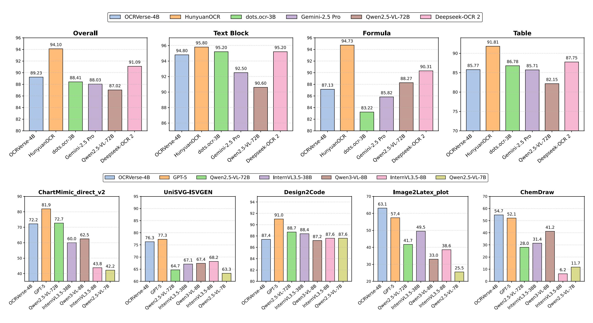
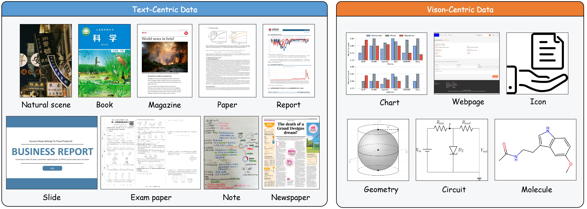
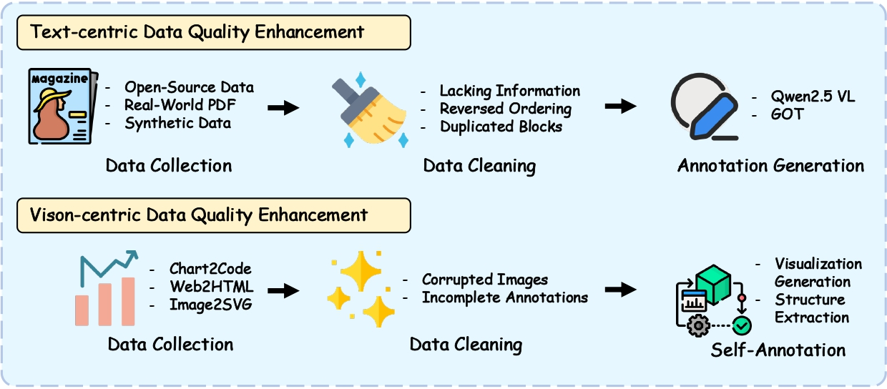
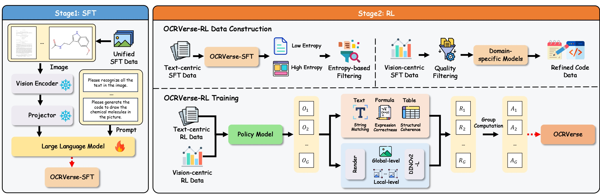

<div align="center">
  <h1>OCRVerse: Towards Holistic OCR in End-to-End  Vision-Language Models</h1>
</div>

<div align="center">
<a href='https://arxiv.org/abs/2601.21639'></a>&ensp;
<a href='https://huggingface.co/DocTron/OCRVerse'></a>&ensp;
<a href=https://github.com/tatsu-lab/stanford_alpaca/blob/main/LICENSE></a>
</div>

<div align="center">

Yufeng Zhong*, Lei Chen*, Xuanle Zhao*, Wenkang Han, Liming Zheng, Jing Huang, Deyang Jiang, Yilin Cao, Lin Ma $^{\dagger}$, Zhixiong Zeng $^{\dagger}$

<strong>Meituan</strong>

*Equal Contribution, $^{\dagger}$ Corresponding Authors
</div>

---

The development of large vision language models drives the demand for managing, and applying massive amounts of multimodal data, making OCR technology, which extracts information from visual images, increasingly popular. However, existing OCR methods primarily focus on recognizing text elements from images or scanned documents (**Text-centric OCR**), neglecting the identification of visual elements from visually information-dense image sources (**Vision-centric OCR**), such as charts, web pages and science plots. In reality, these visually information-dense images are widespread on the internet and have significant real-world application value, such as data visualization and web page analysis.
In this technical report, we propose **OCRVerse**, the first holistic OCR method in end-to-end manner that enables unified text-centric OCR and vision-centric OCR.
To this end, we constructe comprehensive data engineering to cover a wide range of text-centric documents, such as newspapers, magazines and books, as well as vision-centric rendered composites, including charts, web pages and scientific plots.
Moreover, we propose a two-stage SFT-RL multi-domain training method for OCRVerse. SFT directly mixes cross-domain data to train and establish initial domain knowledge, while RL focuses on designing personalized reward strategies for the characteristics of each domain. Specifically, since different domains require various output formats and expected outputs, we provide sufficient flexibility in the RL stage to customize flexible reward signals for each domain, thereby improving cross-domain fusion and avoiding data conflicts.
Experimental results demonstrate the effectiveness of OCRVerse, achieving competitive results across text-centric and vision-centric data types, even comparable to large-scale open-source and closed-source models.

<div align="center">
<!--  -->
</div>

# 📢 News and Updates
* **[Jan 30, 2026]** 📄 Preprint released on [arXiv](https://arxiv.org/abs/2601.21639).
* **[Jan 30, 2026]** 🤗 We upload our model weights [OCRVerse](https://huggingface.co/DocTron/OCRVerse) to HuggingFace.
* **[Nov 3, 2025]** 🤗 We upload our model weights [OCRVerse-code](https://huggingface.co/DocTron/OCRVerse-code) to HuggingFace.
* **[Oct 27, 2025]** 🤗 We upload our model weights [OCRVerse-text](https://huggingface.co/DocTron/OCRVerse-text) to HuggingFace.

<!-- # 🤗 Models
|  Model   | Download Link  |
|  ----  | ----  |
|  OCRVerse-text |  [DocTron/OCRVerse-text](https://huggingface.co/DocTron/OCRVerse-text)  |
|  OCRVerse-code |  [DocTron/OCRVerse-code](https://huggingface.co/DocTron/OCRVerse-code)  | -->

# 💡 Benchmarking


Performance comparison of OCRVerse on text-centric OCR tasks (top row) and vision-centric OCR tasks (bottom row). Since existing OCR methods primarily focus on text-centric scenarios, we compare against both specialized OCR models and general-purpose models for text-centric benchmarks, while comparing only against general-purpose models for vision-centric benchmarks.

# 📚 Dataset Sources


OCRVerse encompasses both text-centric and vision-centric data types, comprehensively supporting the data requirements of holistic OCR. The text-centric data types cover nine document scenarios: natural scenes, books, magazines, papers, reports, slides, exam papers, notes, and newspapers, which encompass high-frequency text scenarios in daily life and meet essential OCR needs. The vision-centric data types comprise six specialized scenarios: charts, webpages, icons, geometry, circuits, and molecules, which focus on professional structured content and address gaps not covered by text-centric categories.

# 📥 Data Processing

Our training dataset is constructed through a systematic multi-stage pipeline that integrates both text-centric and vision-centric data sources to ensure comprehensive coverage and high quality. The data processing workflow encompasses data collection, cleaning, and annotation generation (including self-annotation).

# 🤖 Pipeline

We propose a two-stage SFT-RL multi-domain training method. In the SFT stage, we aim to establish foundational cross-domain knowledge by directly mixing data from all domains. This approach enables the model to learn diverse visual patterns and output formats across both text-centric and vision-centric scenarios, thereby building a unified representation space. In the RL stage, we aim to resolve domain-specific conflicts and optimize personalized performance for each domain. Since different domains require various output formats and quality expectations, we design customized reward strategies tailored to the characteristics of each domain, such as structural accuracy for tables and semantic fidelity for charts. This flexible reward mechanism effectively improves cross-domain fusion while avoiding data conflicts that typically arise from naive multi-task learning.

# 📊 Performance

## Text-Centric Evaluation
### Benchmark 
We adopt OmniDocBench v1.5 as the primary testbed to comprehensively evaluate the document parsing capabilities of OCRVerse. This benchmark serves as a rigorous standard to validate model robustness and generalization across real-world applications. OmniDocBench v1.5 is an expanded dataset comprising 1,355 document pages, enriched with 374 additional pages compared to the previous version. It features a balanced distribution of bilingual content in both Chinese and English and covers nine diverse document types—including academic papers, textbooks, financial reports, and exam papers. By incorporating varied layout structures (from single- to multi-column) and rich elements such as text, mathematical formulas, and structured tables, the benchmark enables a thorough assessment of OCRVerse in handling complex parsing scenarios.

### Metrics

End-to-end evaluation assesses the model's accuracy in parsing PDF page content. The evaluation uses the model's Markdown output of the entire PDF page parsing results as the prediction. The Overall metric is calculated as:

$$
\text{Overall} = \frac{(1-\text{Text Edit Distance}) \times 100 + \text{Table TEDS} +\text{Formula CDM}}{3}
$$

### Results

<table>
  <thead>
    <tr>
      <th>Model Type</th>
      <th>Methods</th>
      <th>Release Date</th>
      <th>End to End</th>
      <th>Parameters</th>
      <th>Overall↑</th>
      <th>Text<sup>Edit</sup>↓</th>
      <th>Formula<sup>CDM</sup>↑</th>
      <th>Table<sup>TEDS</sup>↑</th>
      <th>Table<sup>TEDS-S</sup>↑</th>
      <th>Reading Order<sup>Edit</sup>↓</th>
    </tr>
  </thead>
  <tbody>
    <!-- Pipeline Tools -->
    <tr>
      <td rowspan="3">Pipeline Tools</td>
      <td>Marker-1.8.2</td>
      <td>2025</td>
      <td>❌</td>
      <td>-</td>
      <td>71.30</td>
      <td>0.206</td>
      <td>76.66</td>
      <td>57.88</td>
      <td>71.17</td>
      <td>0.250</td>
    </tr>
    <tr>
      <td>Mineru2-pipeline</td>
      <td>2025</td>
      <td>❌</td>
      <td>-</td>
      <td>75.51</td>
      <td>0.209</td>
      <td>76.55</td>
      <td>70.90</td>
      <td>79.11</td>
      <td>0.225</td>
    </tr>
    <tr>
      <td>PP-StructureV3</td>
      <td>2024</td>
      <td>❌</td>
      <td>-</td>
      <td>86.73</td>
      <td>0.073</td>
      <td>85.79</td>
      <td>81.68</td>
      <td>89.48</td>
      <td>0.073</td>
    </tr>
    <!-- General VLMs -->
    <tr>
      <td rowspan="5">General VLMs</td>
      <td>GPT-4o</td>
      <td>2024</td>
      <td>✅</td>
      <td>-</td>
      <td>75.02</td>
      <td>0.217</td>
      <td>79.70</td>
      <td>67.07</td>
      <td>76.09</td>
      <td>0.148</td>
    </tr>
    <tr>
      <td>InternVL3-76B</td>
      <td>2025</td>
      <td>✅</td>
      <td>76B</td>
      <td>80.33</td>
      <td>0.131</td>
      <td>83.42</td>
      <td>70.64</td>
      <td>77.74</td>
      <td>0.113</td>
    </tr>
    <tr>
      <td>InternVL3.5-241B</td>
      <td>2025</td>
      <td>✅</td>
      <td>241B</td>
      <td>82.67</td>
      <td>0.142</td>
      <td>87.23</td>
      <td>75.00</td>
      <td>81.28</td>
      <td>0.125</td>
    </tr>
    <tr>
      <td>Qwen2.5-VL-72B</td>
      <td>2025</td>
      <td>✅</td>
      <td>72B</td>
      <td>87.02</td>
      <td>0.094</td>
      <td>88.27</td>
      <td>82.15</td>
      <td>86.22</td>
      <td>0.102</td>
    </tr>
    <tr>
      <td>Gemini-2.5 Pro</td>
      <td>2025</td>
      <td>✅</td>
      <td>-</td>
      <td>88.03</td>
      <td>0.075</td>
      <td>85.82</td>
      <td>85.71</td>
      <td>90.29</td>
      <td>0.097</td>
    </tr>
    <!-- Specialized VLMs: End to End ❌ -->
    <tr>
      <td rowspan="18">Specialized VLMs</td>
      <td>Dolphin</td>
      <td>2025.05</td>
      <td>❌</td>
      <td>322M</td>
      <td>74.67</td>
      <td>0.125</td>
      <td>67.85</td>
      <td>68.70</td>
      <td>77.77</td>
      <td>0.124</td>
    </tr>
    <tr>
      <td>MinerU2-VLM</td>
      <td>2025.06</td>
      <td>❌</td>
      <td>0.9B</td>
      <td>85.56</td>
      <td>0.078</td>
      <td>80.95</td>
      <td>83.54</td>
      <td>87.66</td>
      <td>0.086</td>
    </tr>
    <tr>
      <td>MonkeyOCR-pro-1.2B</td>
      <td>2025.07</td>
      <td>❌</td>
      <td>1.9B</td>
      <td>86.96</td>
      <td>0.084</td>
      <td>85.02</td>
      <td>84.24</td>
      <td>89.02</td>
      <td>0.130</td>
    </tr>
    <tr>
      <td>MonkeyOCR-3B</td>
      <td>2025.06</td>
      <td>❌</td>
      <td>3.7B</td>
      <td>87.13</td>
      <td>0.075</td>
      <td>87.45</td>
      <td>81.39</td>
      <td>85.92</td>
      <td>0.129</td>
    </tr>
    <tr>
      <td>MonkeyOCR-pro-3B</td>
      <td>2025.07</td>
      <td>❌</td>
      <td>3.7B</td>
      <td>88.85</td>
      <td>0.075</td>
      <td>87.25</td>
      <td>86.78</td>
      <td>90.63</td>
      <td>0.128</td>
    </tr>
    <tr>
      <td>MinerU2.5</td>
      <td>2025.09</td>
      <td>❌</td>
      <td>1.2B</td>
      <td>90.67</td>
      <td>0.047</td>
      <td>88.46</td>
      <td>88.22</td>
      <td>92.38</td>
      <td>0.044</td>
    </tr>
    <tr>
      <td>PaddleOCR-VL</td>
      <td>2025.10</td>
      <td>❌</td>
      <td>0.9B</td>
      <td>92.56</td>
      <td>0.035</td>
      <td>91.43</td>
      <td>89.76</td>
      <td>93.52</td>
      <td>0.043</td>
    </tr>
    <!-- Specialized VLMs: End to End ✅ -->
    <tr>
      <td>OCRFlux-3B</td>
      <td>2025.06</td>
      <td>✅</td>
      <td>3B</td>
      <td>74.82</td>
      <td>0.193</td>
      <td>68.03</td>
      <td>75.75</td>
      <td>80.23</td>
      <td>0.202</td>
    </tr>
    <tr>
      <td>Mistral OCR</td>
      <td>2025.03</td>
      <td>✅</td>
      <td>-</td>
      <td>78.83</td>
      <td>0.164</td>
      <td>82.84</td>
      <td>70.03</td>
      <td>78.04</td>
      <td>0.144</td>
    </tr>
    <tr>
      <td>POINTS-Reader</td>
      <td>2025.08</td>
      <td>✅</td>
      <td>3B</td>
      <td>80.98</td>
      <td>0.134</td>
      <td>79.20</td>
      <td>77.13</td>
      <td>81.66</td>
      <td>0.145</td>
    </tr>
    <tr>
      <td>olmOCR-7B</td>
      <td>2025.02</td>
      <td>✅</td>
      <td>7B</td>
      <td>81.79</td>
      <td>0.096</td>
      <td>86.04</td>
      <td>68.92</td>
      <td>74.77</td>
      <td>0.121</td>
    </tr>
    <tr>
      <td>Nanonets-OCR-s</td>
      <td>2025.06</td>
      <td>✅</td>
      <td>3B</td>
      <td>85.59</td>
      <td>0.093</td>
      <td>85.90</td>
      <td>80.14</td>
      <td>85.57</td>
      <td>0.108</td>
    </tr>
    <tr>
      <td>Deepseek-OCR</td>
      <td>2025.10</td>
      <td>✅</td>
      <td>3B</td>
      <td>87.01</td>
      <td>0.073</td>
      <td>83.37</td>
      <td>84.97</td>
      <td>88.80</td>
      <td>0.086</td>
    </tr>
    <tr>
      <td>dots.ocr</td>
      <td>2025.07</td>
      <td>✅</td>
      <td>3B</td>
      <td>88.41</td>
      <td>0.048</td>
      <td>83.22</td>
      <td>86.78</td>
      <td>90.62</td>
      <td>0.053</td>
    </tr>
    <tr>
      <td>FD-RL</td>
      <td>2025.11</td>
      <td>✅</td>
      <td>4B</td>
      <td>90.41</td>
      <td>0.049</td>
      <td>88.67</td>
      <td>87.35</td>
      <td>92.10</td>
      <td>0.055</td>
    </tr>
    <tr>
      <td>HunyuanOCR</td>
      <td>2025.11</td>
      <td>✅</td>
      <td>4B</td>
      <td>94.10</td>
      <td>0.042</td>
      <td>94.73</td>
      <td>91.81</td>
      <td>-</td>
      <td>-</td>
    </tr>
    <tr>
      <td>Deepseek-OCR 2</td>
      <td>2026.01</td>
      <td>✅</td>
      <td>1B</td>
      <td>91.09</td>
      <td>0.048</td>
      <td>90.31</td>
      <td>87.75</td>
      <td>92.06</td>
      <td>0.057</td>
    </tr>
    <tr>
      <td>OCRVerse(Ours)</td>
      <td>2026.01</td>
      <td>✅</td>
      <td>4B</td>
      <td>89.23</td>
      <td>0.052</td>
      <td>87.13</td>
      <td>85.77</td>
      <td>90.35</td>
      <td>0.068</td>
    </tr>
  </tbody>
</table>

<!-- ### Performance Across Diverse Page Types

The following table illustrates the text recognition performance (Edit Distance) of the OCRVerse model across 9 different document types. It is intended to offer deeper insights into the model’s performance on diverse page types, thereby enabling a more nuanced understanding of its capabilities and limitations in different real-world document scenarios.

<table>
    <thead>
        <tr>
            <th>Model Type</th>
            <th>Models</th>
            <th>End to End</th>
            <th>Slides</th>
            <th>Academic Papers</th>
            <th>Book</th>
            <th>Textbook</th>
            <th>Exam Papers</th>
            <th>Magazine</th>
            <th>Newspaper</th>
            <th>Notes</th>
            <th>Financial Report</th>
        </tr>
    </thead>
    <tbody>
        <tr>
            <td rowspan="3">Pipeline Tools</td>
            <td>Marker-1.8.2</td>
            <td>❌</td>
            <td>0.1796</td>
            <td>0.0412</td>
            <td>0.1010</td>
            <td>0.2908</td>
            <td>0.2958</td>
            <td>0.1111</td>
            <td>0.2717</td>
            <td>0.4656</td>
            <td>0.0341</td>
        </tr>
        <tr>
            <td>MinerU2-pipeline</td>
            <td>❌</td>
            <td>0.4244</td>
            <td>0.0230</td>
            <td>0.2628</td>
            <td>0.1224</td>
            <td>0.0822</td>
            <td>0.395</td>
            <td>0.0736</td>
            <td>0.2603</td>
            <td>0.0411</td>
        </tr>
        <tr>
            <td>PP-StructureV3</td>
            <td>❌</td>
            <td>0.0794</td>
            <td>0.0236</td>
            <td>0.0415</td>
            <td>0.1107</td>
            <td>0.0945</td>
            <td>0.0722</td>
            <td>0.0617</td>
            <td>0.1236</td>
            <td>0.0181</td>
        </tr>
        <tr>
            <td rowspan="5">General VLMs</td>
            <td>GPT-4o</td>
            <td>✅</td>
            <td>0.1019</td>
            <td>0.1203</td>
            <td>0.1288</td>
            <td>0.1599</td>
            <td>0.1939</td>
            <td>0.142</td>
            <td>0.6254</td>
            <td>0.2611</td>
            <td>0.3343</td>
        </tr>
        <tr>
            <td>InternVL3-76B</td>
            <td>✅</td>
            <td>0.0349</td>
            <td>0.1052</td>
            <td>0.0629</td>
            <td>0.0827</td>
            <td>0.1007</td>
            <td>0.0406</td>
            <td>0.5826</td>
            <td>0.0924</td>
            <td>0.0665</td>
        </tr>
        <tr>
            <td>InternVL3.5-241B</td>
            <td>✅</td>
            <td>0.0475</td>
            <td>0.0857</td>
            <td>0.0237</td>
            <td>0.1061</td>
            <td>0.0933</td>
            <td>0.0577</td>
            <td>0.6403</td>
            <td>0.1357</td>
            <td>0.1117</td>
        </tr>
        <tr>
            <td>Qwen2.5-VL-72B</td>
            <td>✅</td>
            <td>0.0422</td>
            <td>0.0801</td>
            <td>0.0586</td>
            <td>0.1146</td>
            <td>0.0681</td>
            <td>0.0964</td>
            <td>0.238</td>
            <td>0.1232</td>
            <td>0.0264</td>
        </tr>
        <tr>
            <td>Gemini-2.5 Pro</td>
            <td>✅</td>
            <td>0.0326</td>
            <td>0.0182</td>
            <td>0.0694</td>
            <td>0.1618</td>
            <td>0.0937</td>
            <td>0.0161</td>
            <td>0.1347</td>
            <td>0.1169</td>
            <td>0.0169</td>
        </tr>
        <tr>
            <td rowspan="12" style="vertical-align: middle;">Specialized VLMs</td>
            <td>Dolphin</td>
            <td>❌</td>
            <td>0.0957</td>
            <td>0.0453</td>
            <td>0.0616</td>
            <td>0.1333</td>
            <td>0.1684</td>
            <td>0.0702</td>
            <td>0.2388</td>
            <td>0.2561</td>
            <td>0.0186</td>
        </tr>
        <tr>
            <td>MinerU2-VLM</td>
            <td>❌</td>
            <td>0.0745</td>
            <td>0.0104</td>
            <td>0.0357</td>
            <td>0.1276</td>
            <td>0.0698</td>
            <td>0.0652</td>
            <td>0.1831</td>
            <td>0.0803</td>
            <td>0.0236</td>
        </tr>
        <tr>
            <td>MonkeyOCR-pro-1.2B</td>
            <td>❌</td>
            <td>0.0961</td>
            <td>0.0354</td>
            <td>0.053</td>
            <td>0.111</td>
            <td>0.0887</td>
            <td>0.0494</td>
            <td>0.0995</td>
            <td>0.1686</td>
            <td>0.0198</td>
        </tr>
        <tr>
            <td>MonkeyOCR-pro-3B</td>
            <td>❌</td>
            <td>0.0904</td>
            <td>0.0362</td>
            <td>0.0489</td>
            <td>0.1072</td>
            <td>0.0745</td>
            <td>0.0475</td>
            <td>0.0962</td>
            <td>0.1165</td>
            <td>0.0196</td>
        </tr>
        <tr>
            <td>MinerU2.5</td>
            <td>❌</td>
            <td>0.0294</td>
            <td>0.0235</td>
            <td>0.0332</td>
            <td>0.0499</td>
            <td>0.0681</td>
            <td>0.0316</td>
            <td>0.054</td>
            <td>0.1161</td>
            <td>0.0104</td>
        </tr>
        <tr>
            <td>OCRFlux</td>
            <td>✅</td>
            <td>0.0870</td>
            <td>0.0867</td>
            <td>0.0818</td>
            <td>0.1843</td>
            <td>0.2072</td>
            <td>0.1048</td>
            <td>0.7304</td>
            <td>0.1567</td>
            <td>0.0193</td>
        </tr>
        <tr>
            <td>Mistral-OCR</td>
            <td>✅</td>
            <td>0.0917</td>
            <td>0.0531</td>
            <td>0.0610</td>
            <td>0.1341</td>
            <td>0.1341</td>
            <td>0.0581</td>
            <td>0.5643</td>
            <td>0.3097</td>
            <td>0.0523</td>
        </tr>
        <tr>
            <td>POINTS-Reader</td>
            <td>✅</td>
            <td>0.0334</td>
            <td>0.0779</td>
            <td>0.0671</td>
            <td>0.1372</td>
            <td>0.1901</td>
            <td>0.1343</td>
            <td>0.3789</td>
            <td>0.0937</td>
            <td>0.0951</td>
        </tr>
        <tr>
            <td>olmOCR-7B</td>
            <td>✅</td>
            <td>0.0497</td>
            <td>0.0365</td>
            <td>0.0539</td>
            <td>0.1204</td>
            <td>0.0728</td>
            <td>0.0697</td>
            <td>0.2916</td>
            <td>0.122</td>
            <td>0.0459</td>
        </tr>
        <tr>
            <td>Nanonets-OCR-s</td>
            <td>✅</td>
            <td>0.0551</td>
            <td>0.0578</td>
            <td>0.0606</td>
            <td>0.0931</td>
            <td>0.0834</td>
            <td>0.0917</td>
            <td>0.1965</td>
            <td>0.1606</td>
            <td>0.0395</td>
        </tr>
        <tr>
            <td>dots.ocr</td>
            <td>✅</td>
            <td>0.0290</td>
            <td>0.0231</td>
            <td>0.0433</td>
            <td>0.0788</td>
            <td>0.0467</td>
            <td>0.0221</td>
            <td>0.0667</td>
            <td>0.1116</td>
            <td>0.0076</td>
        </tr>
        <tr>
            <td>OCRVerse</td>
            <td>✅</td>
            <td>0.0260</td>
            <td>0.0427</td>
            <td>0.0412</td>
            <td>0.0921</td>
            <td>0.0507</td>
            <td>0.0303</td>
            <td>0.0982</td>
            <td>0.0695</td>
            <td>0.0064</td>
        </tr>
    </tbody>
</table> -->


<!-- ### Performance Across Diverse Layouts

End-to-end reading order evaluation on OmniDocBench: results across different column layout types using Normalized Edit Distance.

<table style="border-collapse: collapse;">
  <thead>
    <tr style="border: 1px solid black;">
      <th style="border: 1px solid black;">model</th>
      <th style="border: 1px solid black;">Single Column</th>
      <th style="border: 1px solid black;">Double Column</th>
      <th style="border: 1px solid black;">Three Column</th>
      <th style="border: 1px solid black;">Other Layout</th>
    </tr>
  </thead>
  <tbody>
    <tr style="border: 1px solid black;">
      <td style="border: 1px solid black;">OCRVerse</td>
      <td style="border: 1px solid black;">0.022</td>
      <td style="border: 1px solid black;">0.042</td>
      <td style="border: 1px solid black;">0.09</td>
      <td style="border: 1px solid black;">0.16</td>
    </tr>
  </tbody>
</table>

### Text Recognition Performance Across Attributes

The following table illustrates the text recognition performance (Edit Distance) of the OCRVerse model across diverse text attributes, including language, background, and rotation. It is intended to offer deeper insights into the model’s performance under different text properties, thereby enabling a more nuanced understanding of its capabilities and limitations in real-world document scenarios.

<table style="border-collapse: collapse;">
  <thead>
    <tr style="border-bottom: none;">
      <th rowspan="2" style="border: 1px solid black;">Model</th>
      <th colspan="3" style="border: 1px solid black;">Language</th>
      <th colspan="3" style="border: 1px solid black;">Text background</th>
      <th colspan="3" style="border: 1px solid black;">Text Rotate</th>
    </tr>
    <tr>
      <th style="border: 1px solid black;">EN</th>
      <th style="border: 1px solid black;">ZH</th>
      <th style="border: 1px solid black;">Mixed</th>
      <th style="border: 1px solid black;">White</th>
      <th style="border: 1px solid black;">Single</th>
      <th style="border: 1px solid black;">Multi</th>
      <th style="border: 1px solid black;">Normal</th>
      <th style="border: 1px solid black;">Rotate270</th>
      <th style="border: 1px solid black;">Horizontal</th>
    </tr>
  </thead>
  <tbody>
    <tr>
      <td style="border: 1px solid black;">OCRVerse</td>
      <td style="border: 1px solid black;">0.077</td>
      <td style="border: 1px solid black;">0.084</td>
      <td style="border: 1px solid black;">0.062</td>
      <td style="border: 1px solid black;">0.081</td>
      <td style="border: 1px solid black;">0.068</td>
      <td style="border: 1px solid black;">0.08</td>
      <td style="border: 1px solid black;">0.078</td>
      <td style="border: 1px solid black;">0.968</td>
      <td style="border: 1px solid black;">0.232</td>
    </tr>
  </tbody>
</table>
 -->


## Vison-Centric Evaluation

### Benchmarks
To comprehensively evaluate the vision-centric OCR capabilities of our proposed OCRVerse, we conducted extensive experiments across five diverse structured vision-centric benchmarks. These benchmarks cover a wide spectrum of visual domains, assessing the model's ability to translate visually dense information into executable code or structured representations. Specifically, the evaluation tasks include: (1) ChartMimic for direct chart-to-code generation; (2) Design2Code, which evaluates the precision of reproducing web layouts in the web-to-HTML task; (3) UniSVG, assessing the generation of scalable vector graphics in the image-to-SVG task; (4) Image2Struct, testing the conversion of scientific documents and formulas in the image-to-LaTeX task; (5) ChemDraw, focusing on the recognition of chemical structures in the molecule-to-code task.

### Metrics
For all benchmarks, we strictly adhere to the evaluation protocols officially defined in their respective GitHub repositories or original papers. For ChartMimic, we report the code execution success rate and the average of low-level metrics (Text, Layout, Type, and Color Scores). For high-level evaluation, we employ the GPT-4o Score. Regarding UniSVG, we present the low-level score, computed as the average of SSIM and (1 - LPIPS), alongside the high-level CLIP similarity. For Design2Code, we report both the CLIP similarity (high-level) and the element-matching scores (low-level) proposed by the benchmark authors. For Image2Struct, we evaluate using the earth mover's similarity (EMS) and the rendering success rate. Finally, for ChemDraw, we report the code execution success rate and the Tanimoto similarity.

### Results

<!-- <table>
  <thead>
    <tr>
      <th rowspan="2">Model</th>
      <th rowspan="2">Parameter</th>
      <th colspan="3" class="header-group">ChartMimic_direct_v2</th>
      <th colspan="3" class="header-group">UniSVG-ISVGEN</th>
      <th colspan="2" class="header-group">Design2Code</th>
      <th colspan="2" class="header-group">Image2Latex_plot</th>
      <th colspan="2" class="header-group">ChemDraw</th>
    </tr>
    <tr>
      <th class="subheader">Exec.Rate</th>
      <th class="subheader">Low-Level</th>
      <th class="subheader">High-Level</th>
      <th class="subheader">Low-Level</th>
      <th class="subheader">High-Level</th>
      <th class="subheader">Score</th>
      <th class="subheader">Low-Level</th>
      <th class="subheader">High-Level</th>
      <th class="subheader">Ren.Succ.</th>
      <th class="subheader">EMS</th>
      <th class="subheader">Exec.Rate</th>
      <th class="subheader">Tani.Sim.</th>
    </tr>
  </thead>
  <tbody>
    <tr>
      <td colspan="14" class="model-category">Closed-Source Models</td>
    </tr>
    <tr class="gray-row">
      <td>Gemini-2.5-Pro</td>
      <td>-</td>
      <td>97.3</td>
      <td>88.7</td>
      <td>83.8</td>
      <td>53.6</td>
      <td>80.3</td>
      <td>69.6</td>
      <td>90.8</td>
      <td>91.4</td>
      <td>74.3</td>
      <td>52.5</td>
      <td>77.3</td>
      <td>2.8</td>
    </tr>
    <tr class="gray-row">
      <td>Claude-4.5-Sonnet</td>
      <td>-</td>
      <td>97.8</td>
      <td>89.6</td>
      <td>82.9</td>
      <td>61.0</td>
      <td>83.4</td>
      <td>74.6</td>
      <td>90.4</td>
      <td>90.8</td>
      <td>72.7</td>
      <td>50.2</td>
      <td>95.3</td>
      <td>41.7</td>
    </tr>
    <tr class="gray-row">
      <td>GPT-5</td>
      <td>-</td>
      <td>94.8</td>
      <td>81.9</td>
      <td>78.3</td>
      <td>60.8</td>
      <td>88.3</td>
      <td>77.3</td>
      <td>90.6</td>
      <td>91.0</td>
      <td>78.7</td>
      <td>57.4</td>
      <td>93.8</td>
      <td>52.1</td>
    </tr>
    <tr>
      <td colspan="14" class="model-category">Open-Source Models</td>
    </tr>
    <tr>
      <td>Qwen2.5-VL-7B</td>
      <td>7B</td>
      <td>68.7</td>
      <td>42.2</td>
      <td>40.1</td>
      <td>47.5</td>
      <td>73.8</td>
      <td>63.3</td>
      <td>83.4</td>
      <td>87.6</td>
      <td>42.7</td>
      <td>25.5</td>
      <td>21.1</td>
      <td>11.7</td>
    </tr>
    <tr>
      <td>Qwen3-VL-8B</td>
      <td>8B</td>
      <td>78.3</td>
      <td>62.5</td>
      <td>67.8</td>
      <td>53.0</td>
      <td>77.0</td>
      <td>67.4</td>
      <td>85.5</td>
      <td>87.2</td>
      <td>47.7</td>
      <td>33.0</td>
      <td>78.9</td>
      <td>41.2</td>
    </tr>
    <tr>
      <td>InternVL3.5-8B</td>
      <td>8B</td>
      <td>66.7</td>
      <td>46.0</td>
      <td>48.3</td>
      <td>55.0</td>
      <td>78.0</td>
      <td>68.6</td>
      <td>85.8</td>
      <td>87.3</td>
      <td>58.3</td>
      <td>40.5</td>
      <td>49.2</td>
      <td>7.8</td>
    </tr>
    <tr>
      <td>InternVL3.5-14B</td>
      <td>14B</td>
      <td>73.2</td>
      <td>52.8</td>
      <td>55.4</td>
      <td>52.0</td>
      <td>75.0</td>
      <td>65.9</td>
      <td>86.1</td>
      <td>87.8</td>
      <td>73.0</td>
      <td>50.2</td>
      <td>71.9</td>
      <td>39.3</td>
    </tr>
    <tr>
      <td>Qwen3-VL-32B</td>
      <td>32B</td>
      <td>83.0</td>
      <td>66.9</td>
      <td>77.5</td>
      <td>68.0</td>
      <td>86.0</td>
      <td>78.8</td>
      <td>88.6</td>
      <td>89.8</td>
      <td>75.7</td>
      <td>53.3</td>
      <td>37.5</td>
      <td>48.8</td>
    </tr>
    <tr>
      <td>InternVL3.5-38B</td>
      <td>38B</td>
      <td>79.0</td>
      <td>60.0</td>
      <td>71.8</td>
      <td>51.9</td>
      <td>77.3</td>
      <td>67.1</td>
      <td>87.8</td>
      <td>88.4</td>
      <td>72.6</td>
      <td>49.5</td>
      <td>55.5</td>
      <td>31.4</td>
    </tr>
    <tr>
      <td>Qwen2.5-VL-72B</td>
      <td>72B</td>
      <td>88.5</td>
      <td>72.7</td>
      <td>79.1</td>
      <td>47.7</td>
      <td>76.0</td>
      <td>64.7</td>
      <td>86.9</td>
      <td>88.7</td>
      <td>62.0</td>
      <td>41.7</td>
      <td>75.8</td>
      <td>28.0</td>
    </tr>
    <tr>
      <td>OCRVerse</td>
      <td>4B</td>
      <td>82.0</td>
      <td>65.7</td>
      <td>74.3</td>
      <td>82.1</td>
      <td>93.4</td>
      <td>88.8</td>
      <td>83.6</td>
      <td>86.1</td>
      <td>71.0</td>
      <td>50.4</td>
      <td>85.2</td>
      <td>60.4</td>
    </tr>
  </tbody>
</table> -->

<table>
  <thead>
    <tr>
      <th rowspan="2">Model</th>
      <th rowspan="2">Parameter</th>
      <th colspan="3" class="header-group">ChartMimic_direct_v2</th>
      <th colspan="3" class="header-group">UniSVG-ISVGEN</th>
      <th colspan="2" class="header-group">Design2Code</th>
      <th colspan="2" class="header-group">Image2Latex_plot</th>
      <th colspan="2" class="header-group">ChemDraw</th>
    </tr>
    <tr>
      <th class="subheader">Exec.Rate</th>
      <th class="subheader">Low-Level</th>
      <th class="subheader">High-Level</th>
      <th class="subheader">Low-Level</th>
      <th class="subheader">High-Level</th>
      <th class="subheader">Score</th>
      <th class="subheader">Low-Level</th>
      <th class="subheader">High-Level</th>
      <th class="subheader">Ren.Succ.</th>
      <th class="subheader">EMS</th>
      <th class="subheader">Exec.Rate</th>
      <th class="subheader">Tani.Sim.</th>
    </tr>
  </thead>
  <tbody>
    <tr>
      <td colspan="14" class="model-category">Closed-Source Models</td>
    </tr>
    <tr class="gray-row">
      <td>Gemini-2.5-Pro</td>
      <td>-</td>
      <td>97.3</td>
      <td>88.7</td>
      <td>83.8</td>
      <td>53.6</td>
      <td>80.3</td>
      <td>69.6</td>
      <td>90.8</td>
      <td>91.4</td>
      <td>74.3</td>
      <td>52.5</td>
      <td>77.3</td>
      <td>2.8</td>
    </tr>
    <tr class="gray-row">
      <td>Claude-4.5-Sonnet</td>
      <td>-</td>
      <td>97.8</td>
      <td>89.6</td>
      <td>82.9</td>
      <td>61.0</td>
      <td>83.4</td>
      <td>74.6</td>
      <td>90.4</td>
      <td>90.8</td>
      <td>72.7</td>
      <td>50.2</td>
      <td>95.3</td>
      <td>41.7</td>
    </tr>
    <tr class="gray-row">
      <td>GPT-5</td>
      <td>-</td>
      <td>94.8</td>
      <td>81.9</td>
      <td>78.3</td>
      <td>60.8</td>
      <td>88.3</td>
      <td>77.3</td>
      <td>90.6</td>
      <td>91.0</td>
      <td>78.7</td>
      <td>57.4</td>
      <td>93.8</td>
      <td>52.1</td>
    </tr>
    <tr>
      <td colspan="14" class="model-category">Open-Source Models</td>
    </tr>
    <tr>
      <td>Qwen2.5-VL-7B</td>
      <td>7B</td>
      <td>68.7</td>
      <td>42.2</td>
      <td>40.1</td>
      <td>47.5</td>
      <td>73.8</td>
      <td>63.3</td>
      <td>83.4</td>
      <td>87.6</td>
      <td>42.7</td>
      <td>25.5</td>
      <td>21.1</td>
      <td>11.7</td>
    </tr>
    <tr>
      <td>InternVL3-8B</td>
      <td>8B</td>
      <td>63.3</td>
      <td>43.8</td>
      <td>46.1</td>
      <td>54.5</td>
      <td>77.4</td>
      <td>68.2</td>
      <td>85.3</td>
      <td>87.6</td>
      <td>57.7</td>
      <td>38.6</td>
      <td>42.2</td>
      <td>6.2</td>
    </tr>
    <tr>
      <td>Qwen3-VL-8B</td>
      <td>8B</td>
      <td>78.3</td>
      <td>62.5</td>
      <td>67.8</td>
      <td>53.0</td>
      <td>77.0</td>
      <td>67.4</td>
      <td>85.5</td>
      <td>87.2</td>
      <td>47.7</td>
      <td>33.0</td>
      <td>78.9</td>
      <td>41.2</td>
    </tr>
    <tr>
      <td>InternVL3.5-8B</td>
      <td>8B</td>
      <td>66.7</td>
      <td>46.0</td>
      <td>48.3</td>
      <td>55.0</td>
      <td>78.0</td>
      <td>68.6</td>
      <td>85.8</td>
      <td>87.3</td>
      <td>58.3</td>
      <td>40.5</td>
      <td>49.2</td>
      <td>7.8</td>
    </tr>
    <tr>
      <td>InternVL3-14B</td>
      <td>14B</td>
      <td>72.3</td>
      <td>51.3</td>
      <td>54.1</td>
      <td>51.4</td>
      <td>75.5</td>
      <td>65.8</td>
      <td>85.8</td>
      <td>87.5</td>
      <td>73.3</td>
      <td>52.2</td>
      <td>71.1</td>
      <td>40.2</td>
    </tr>
    <tr>
      <td>InternVL3.5-14B</td>
      <td>14B</td>
      <td>73.2</td>
      <td>52.8</td>
      <td>55.4</td>
      <td>52.0</td>
      <td>75.0</td>
      <td>65.9</td>
      <td>86.1</td>
      <td>87.8</td>
      <td>73.0</td>
      <td>50.2</td>
      <td>71.9</td>
      <td>39.3</td>
    </tr>
    <tr>
      <td>Qwen3-VL-32B</td>
      <td>32B</td>
      <td>83.0</td>
      <td>66.9</td>
      <td>77.5</td>
      <td>68.0</td>
      <td>86.0</td>
      <td>78.8</td>
      <td>88.6</td>
      <td>89.8</td>
      <td>75.7</td>
      <td>53.3</td>
      <td>37.5</td>
      <td>48.8</td>
    </tr>
    <tr>
      <td>InternVL3.5-38B</td>
      <td>38B</td>
      <td>79.0</td>
      <td>60.0</td>
      <td>71.8</td>
      <td>51.9</td>
      <td>77.3</td>
      <td>67.1</td>
      <td>87.8</td>
      <td>88.4</td>
      <td>72.6</td>
      <td>49.5</td>
      <td>55.5</td>
      <td>31.4</td>
    </tr>
    <tr>
      <td>Qwen2.5-VL-72B</td>
      <td>72B</td>
      <td>88.5</td>
      <td>72.7</td>
      <td>79.1</td>
      <td>47.7</td>
      <td>76.0</td>
      <td>64.7</td>
      <td>86.9</td>
      <td>88.7</td>
      <td>62.0</td>
      <td>41.7</td>
      <td>75.8</td>
      <td>28.0</td>
    </tr>
    <tr>
      <td>OCRVerse (Ours)</td>
      <td>4B</td>
      <td>84.8</td>
      <td>72.2</td>
      <td>75.4</td>
      <td>63.2</td>
      <td>85.2</td>
      <td>76.3</td>
      <td>85.7</td>
      <td>87.4</td>
      <td>88.7</td>
      <td>63.1</td>
      <td>89.1</td>
      <td>54.7</td>
    </tr>
  </tbody>
</table>

# 🔍 Usage Example

## Inference

### Text-Centric Task

This below is a simple example of how to use OCRVerse for document parsing tasks.

Please first install [transformers](https://github.com/huggingface/transformers) using the following command:

```shell
pip install "transformers>=4.57.0"
```

```python
from transformers import Qwen3VLForConditionalGeneration, AutoProcessor
import torch

# Load model
model_path = 'DocTron/OCRVerse'
model = Qwen3VLForConditionalGeneration.from_pretrained(
    model_path,
    dtype="auto", 
    device_map="cuda",
    trust_remote_code=True
)
processor = AutoProcessor.from_pretrained(model_path, trust_remote_code=True)

# Prepare input with image and text
image_path = "./assets/text_centric_test.jpg"
# We recommend using the following prompt to better performance, since it is used throughout the training process.
prompt = "Extract the main content from the document in the image, keeping the original structure. Convert all formulas to LaTeX and all tables to HTML."

messages = [
    {
        "role": "user",
        "content": [
            {"type": "image", "image": image_path},
            {"type": "text", "text": prompt},
        ]
    }
]

# Preparation for inference
inputs = processor.apply_chat_template(
    messages, 
    tokenize=True, 
    add_generation_prompt=True,
    return_dict=True,
    return_tensors="pt"
)
inputs = inputs.to(model.device)

# Inference: Generation of the output
generated_ids = model.generate(**inputs, max_new_tokens=8192, do_sample=False)

generated_ids = [
    output_ids[len(input_ids):] for input_ids, output_ids in zip(inputs.input_ids, generated_ids)
]
output_text = processor.tokenizer.batch_decode(
    generated_ids, skip_special_tokens=True, clean_up_tokenization_spaces=False
)
print(output_text[0])

# $$
# r = \frac{\alpha}{\beta} \sin \beta (\sigma_1 \pm \sigma_2)
# $$
```

### Vision-Centric Task

Below is a simple example of how to use OCRVerse for vision-centric tasks. We also recommend utilizing [SGLang](https://github.com/sgl-project/sglang) for inference.
```python
from transformers import Qwen3VLForConditionalGeneration, AutoProcessor
import torch

# Load model
model_path = 'DocTron/OCRVerse'
model = Qwen3VLForConditionalGeneration.from_pretrained(
    model_path,
    dtype="auto", 
    device_map="cuda",
    trust_remote_code=True
)
processor = AutoProcessor.from_pretrained(model_path, trust_remote_code=True)

# Prepare input with image and text
image_path = "./assets/vision_centric_test.png"
prompt = "You are an expert Python developer who specializes in writing matplotlib code based on a given picture. I found a very nice picture in a STEM paper, but there is no corresponding source code available. I need your help to generate the Python code that can reproduce the picture based on the picture I provide.\nNote that it is necessary to use figsize=(7.0, 5.0) to set the image size to match the original size.\nNow, please give me the matplotlib code that reproduces the picture below."

messages = [
    {
        "role": "user",
        "content": [
            {"type": "image", "image": image_path},
            {"type": "text", "text": prompt},
        ]
    }
]

# Preparation for inference
inputs = processor.apply_chat_template(
    messages, 
    tokenize=True, 
    add_generation_prompt=True,
    return_dict=True,
    return_tensors="pt"
)
inputs = inputs.to(model.device)

# Inference: Generation of the output
generated_ids = model.generate(**inputs, max_new_tokens=4096, do_sample=False)

generated_ids = [
    output_ids[len(input_ids):] for input_ids, output_ids in zip(inputs.input_ids, generated_ids)
]
output_text = processor.tokenizer.batch_decode(
    generated_ids, skip_special_tokens=True, clean_up_tokenization_spaces=False
)
print(output_text[0])
```

Example scripts for launching SGLang Server
```shell
CUDA_VISIBLE_DEVICES=0,1,2,3 \
python -m sglang.launch_server \
--model-path DocTron/OCRVerse-code \
--host 0.0.0.0 \
--dist-init-addr 127.0.0.1:10002 \
--tp 4 \
--port 6002
```


## Fine-tuning

If you want to continue training based on our model, you can use [Llama Factory](https://github.com/hiyouga/LLaMA-Factory). For installation and usage of Llama Factory, please refer to its official documentation. A reference fine-tuning script with pre-specified parameters is provided below:

```shell
PROJECT_DIR=/path/to/llama_factory
cd ${PROJECT_DIR}

# Set parameters
GPUS_PER_NODE=8                  # Number of GPUs per node
NNODES=1                         # Total number of nodes
NODE_RANK=0                      # Rank of the current node (starts from 0)
MASTER_ADDR=localhost            # IP address of the master node
MASTER_PORT=12345                # Port for communication between nodes

MODEL_DIR=/path/to/ocrverse_text_model  # Path to the pre-trained OCRVerse model
DATA=/name/of/your/dataset               # Name/path of your custom dataset
OUTPUT_DIR=/path/to/output              # Directory to save fine-tuned results

# Llama Factory-based fine-tuning script
torchrun --nproc_per_node="${GPUS_PER_NODE}" --nnodes="${NNODES}" --node_rank="${NODE_RANK}" --master_addr="${MASTER_ADDR}" --master_port="${MASTER_PORT}" \
    src/train.py \
    --model_name_or_path "$MODEL_DIR" \
    --stage sft \
    --do_train True \
    --finetuning_type full \
    --dataset "$DATA" \
    --template qwen3_vl_nothink \
    --cutoff_len 8192 \
    --preprocessing_num_workers 128 \
    --preprocessing_batch_size 256 \
    --dataloader_num_workers 128 \
    --output_dir "$OUTPUT_DIR" \
    --logging_steps 1 \
    --save_steps 5000 \
    --plot_loss True \
    --save_only_model False \
    --report_to none \
    --per_device_train_batch_size 1 \
    --gradient_accumulation_steps 1 \
    --learning_rate 1e-5 \
    --num_train_epochs 1 \
    --lr_scheduler_type cosine \
    --warmup_ratio 0.1 \
    --bf16 True
```

# 📌 Acknowledgement
We sincerely appreciate [LLaMA-Factory](https://github.com/hiyouga/LLaMA-Factory) for providing reference training framework.


<!-- ## 📖 Citation
If you find this project useful, please feel free to leave a star and cite our paper:
```
@misc{chen2025chartr1,
      title={Chart-R1: Chain-of-Thought Supervision and Reinforcement for Advanced Chart Reasoner}, 
      author={Lei Chen and Xuanle Zhao and Zhixiong Zeng and Jing Huang and Yufeng Zhong and Lin Ma},
      year={2025},
      eprint={2507.15509},
      archivePrefix={arXiv},
      primaryClass={cs.AI},
      url={https://arxiv.org/abs/2507.15509}, 
}
``` -->
